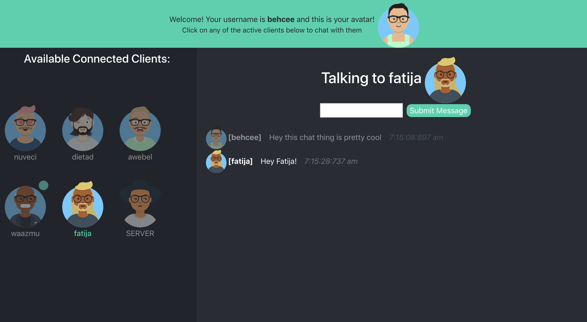
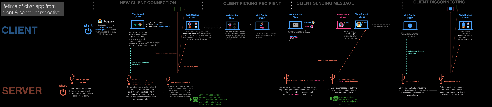
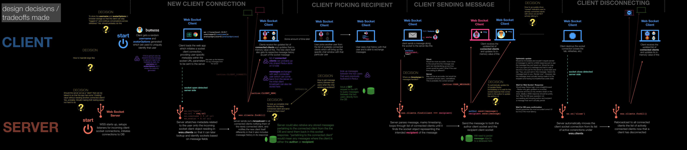
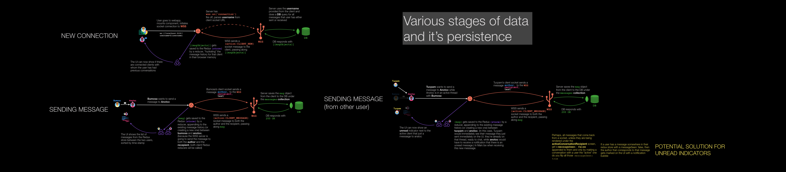

# Messaging App

[Frontend Repo](https://github.com/Tzinov15/messaging-app-frontend) (React 16 (CRA), TypeScript, Hosted on Netlify )

[Backend Repo](https://github.com/Tzinov15/messaging-app-backend) (Node/Express, WebSockets, TypeScript, MongoDB, Hosted on Herok, Using Self-Signed Certs)

# Live Link

# [`https://hopeful-beaver-35d7aa.netlify.com/`](https://hopeful-beaver-35d7aa.netlify.com/)

# Design / Architecture Diagrams

This first diagram depicts the lifetime of a chat app, identifynig and disecting 4 distinct phases of the user-experience from a higher-level system view

- New User Connecting
- User selecting a client to chat with
- User sending a message
- User disconnecting
  

This diagram is very similar to the lifetime diagram above but is sprinkled with various design decisions, trade-offs, and technical choices that I made or thought of throughout the development

And this diagram is a slightly closer view of how data moves and more specifically how the 3 main players in this app - The browser (React App), the server (Web Sockets), and the database (MongoDB) - interact and share data

# Future Features

- Implement [IO Types](https://github.com/gcanti/io-ts). This is a run-time type-checking library that allows any type mismatches between domain seams (UI to API, API to DB, etc) that can't be _compile time_ verified to be verified in a single point of failure at runtime. It's a library I've used numerous times before and has saved me countless troubles tracking down sneaky changes in underlying data contract changes.
- CI/CD Pipline. Would pull in an E2E testing library like Cypress and have future development be driven through PRs that require automation to pass, code-coverage to not have dipped, etc so that I can confidently refactor and no that I won't break prod
- Use [React Storybook](https://storybook.js.org/) to build out a reusable component library and better stress test individual UI components (username under avatar that is too big, loading states, error states, etc)

# Things I wish I had done differently

- Dialed back the scope I set for myself a little bit and slowed down. I was extremely eager and excited when I saw the write up and let feature-creep sneak in features that came at the cost of more testing
- Understand / learn more about scaling problems. What changes in some of the upfront design would have to happen if this was meant for 100,000 users? 1,000,000 users? 1 billion users?
- Dived into Serverless Architecture / Lamda functions. At the beginning I was torn between:

  - diving into WebSockets and having a persistent server with real-time data on the client or
  - forgoing WebSockets, using a naive poll on the client-side, and setting up a server-less API using AWS Lambdas (the option to both was out there, seemed very daunting for this project however)

  I ended up settling on WebSockets for the sake of development speed (have had limited experience from before) but would love to do it over again with Serverless architecture and compare the two solutions
